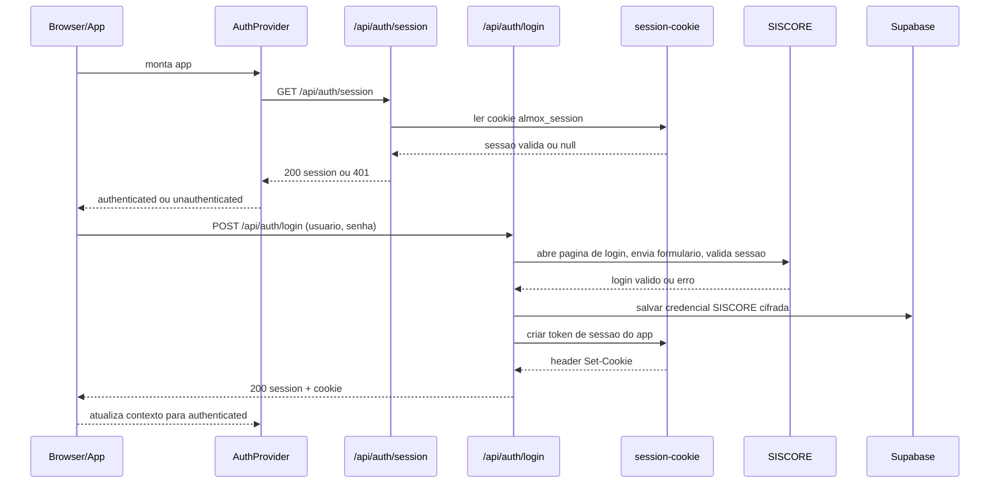

# Fluxo de Login

Documento tecnico para mapear o que acontece no login do site, do bootstrap da aplicacao ate a liberacao da area autenticada.

---

## 1. Escopo

Este fluxo cobre:

1. inicializacao do app;
2. validacao de sessao existente;
3. envio de usuario e senha do SISCORE;
4. validacao no portal SISCORE;
5. criacao da sessao do app;
6. persistencia da credencial para sincronizacoes futuras;
7. logout.

Fora de escopo deste documento:

- sincronizacao da base do SISCORE;
- logica de calculo do dashboard;
- detalhes da importacao de estoque/notas.

---

## 2. Arquivos envolvidos

- Entrada global: [src/app/_layout.tsx](../src/app/_layout.tsx)
- Gate de autenticacao da area logada: [src/app/(app)/_layout.tsx](../src/app/(app)/_layout.tsx)
- Tela de login: [src/app/login.tsx](../src/app/login.tsx)
- Estado de autenticacao no client: [src/features/auth/auth-provider.tsx](../src/features/auth/auth-provider.tsx)
- API de login: [src/app/api/auth/login+api.ts](../src/app/api/auth/login+api.ts)
- API de sessao: [src/app/api/auth/session+api.ts](../src/app/api/auth/session+api.ts)
- API de logout: [src/app/api/auth/logout+api.ts](../src/app/api/auth/logout+api.ts)
- Cookie de sessao do app: [src/server/session-cookie.ts](../src/server/session-cookie.ts)
- Validacao no portal SISCORE: [src/server/siscore-auth.ts](../src/server/siscore-auth.ts)
- Persistencia cifrada da credencial SISCORE: [src/server/siscore-credential-store.ts](../src/server/siscore-credential-store.ts)
- Cliente Supabase admin: [src/server/supabase-admin.ts](../src/server/supabase-admin.ts)

---

## 3. Visao geral

O app nao usa autenticacao nativa do Supabase para o usuario final.

O login funciona assim:

1. o browser abre o app;
2. o `AuthProvider` tenta validar uma sessao propria do app em `/api/auth/session`;
3. se a sessao for valida, a area `(app)` e liberada;
4. se nao for valida, o usuario e redirecionado para `/login`;
5. ao enviar usuario e senha, o backend tenta autenticar no portal SISCORE real;
6. se o SISCORE aceitar:
   - a credencial e salva cifrada no Supabase;
   - o backend gera um cookie proprio do app;
   - o client passa a se considerar autenticado;
7. o app entra na area principal.

Em resumo: o SISCORE valida a identidade, mas a sessao ativa do site e um cookie proprio chamado `almox_session`.

---

## 4. Sequencia cronologica

---

## 5. Etapa por etapa

### 5.1 Bootstrap global

Em [src/app/_layout.tsx](../src/app/_layout.tsx):

- o app sobe dentro de `GestureHandlerRootView` e `SafeAreaProvider`;
- o `AuthProvider` envolve toda a arvore;
- a stack principal registra:
  - `login`
  - `(app)`

Consequencia pratica: toda a navegacao depende primeiro do estado de autenticacao calculado no `AuthProvider`.

### 5.2 AuthProvider sobe em estado `checking`

Em [auth-provider.tsx](../src/features/auth/auth-provider.tsx):

- `status` inicia como `checking`;
- `session` inicia como `null`;
- um `useEffect` chama `refreshSession()` assim que o provider monta.

Enquanto isso, a area `(app)` ainda nao sabe se deve abrir ou redirecionar.

### 5.3 Validacao de sessao existente

`refreshSession()` faz:

- `GET /api/auth/session`
- `credentials: 'include'` para mandar cookie

No backend, [session+api.ts](../src/app/api/auth/session+api.ts):

- chama `lerSessaoDoRequest(request)`;
- se o cookie estiver ausente, invalido ou expirado, responde `401`;
- se estiver valido, responde `{ session: { usuario } }`.

No client:

- `401` vira `status = 'unauthenticated'`;
- `200` vira `status = 'authenticated'` e `session = { usuario }`;
- qualquer erro de rede tambem derruba para `unauthenticated`.

### 5.4 Gate da area logada

Em [src/app/(app)/_layout.tsx](../src/app/(app)/_layout.tsx):

- se `status === 'checking'`, mostra `Validando acesso SISCORE...`;
- se `status !== 'authenticated'`, faz `Redirect` para `/login`;
- se autenticado, monta:
  - `AlmoxDataProvider`
  - `AppShell`

Esse layout e o ponto exato em que o login libera o resto do sistema.

### 5.5 Tela de login

Em [src/app/login.tsx](../src/app/login.tsx):

- se o contexto ja estiver autenticado, a tela nem aparece e faz `Redirect href="/"`;
- o submit chama `login(usuario, senha)` do `AuthProvider`;
- se der certo, faz `router.replace('/')`;
- se der erro, exibe a mensagem retornada pela API, inclusive detalhes em linhas separadas.

Observacao importante:

- esse `router.replace('/')` so acontece porque o proprio `login()` ja colocou o contexto em `authenticated`;
- depois do login bem-sucedido, nao e necessario chamar `/api/auth/session` de novo naquele momento.

### 5.6 API de login

Em [login+api.ts](../src/app/api/auth/login+api.ts):

1. le `usuario` e `senha` do body;
2. valida se ambos vieram preenchidos;
3. chama `autenticarNoSiscore(...)`;
4. se o SISCORE aceitar, chama `salvarCredencialSiscoreUsuario(...)`;
5. cria o token de sessao com `criarSessionToken(session.usuario)`;
6. devolve:
   - `200`
   - `{ session }`
   - header `Set-Cookie`.

Se a autenticacao no SISCORE falhar, a API devolve erro estruturado com status e detalhes.

Se o SISCORE aceitar, mas falhar ao salvar a credencial cifrada no Supabase, o login inteiro e tratado como falha `500`.

### 5.7 O que `autenticarNoSiscore()` faz de fato

Em [siscore-auth.ts](../src/server/siscore-auth.ts), o backend:

1. abre a pagina inicial do SISCORE;
2. captura cookies recebidos nessa abertura;
3. procura o formulario e os campos reais de usuario/senha no HTML;
4. preserva `inputs hidden`;
5. envia `POST` com `application/x-www-form-urlencoded`;
6. reaproveita os cookies da sessao do portal;
7. tenta validar a sessao abrindo a URL de verificacao;
8. considera autenticado quando:
   - a resposta parece um arquivo Excel; ou
   - a resposta deixa de parecer a tela de login.

Se a pagina voltar para um formulario de login, o backend entende que a autenticacao nao se sustentou.

### 5.8 Cookie de sessao do app

Em [session-cookie.ts](../src/server/session-cookie.ts):

- nome do cookie: `almox_session`
- duracao: `8 horas`
- flags:
  - `Path=/`
  - `HttpOnly`
  - `SameSite=Lax`
  - `Secure` apenas quando a URL e `https`

O valor do cookie:

- nao e JWT;
- e um payload em base64url com `usuario` e `exp`;
- assinado com HMAC SHA-256.

Segredo usado para assinatura:

1. `APP_SESSION_SECRET`
2. `SUPABASE_DB_URL`
3. `SUPABASE_PROJECT_REF`
4. fallback local `almox-dev-session-secret`

### 5.9 Persistencia da credencial SISCORE

Em [siscore-credential-store.ts](../src/server/siscore-credential-store.ts):

- a senha nao fica em texto puro no banco;
- ela e cifrada com `AES-256-GCM`;
- a gravacao usa RPC do Supabase admin.

Isso nao serve para autenticar o usuario no frontend.

Serve para permitir que o sistema rode sincronizacoes futuras do SISCORE em nome daquele usuario sem pedir a senha toda vez.

### 5.10 Logout

Em [logout+api.ts](../src/app/api/auth/logout+api.ts):

- o backend devolve um `Set-Cookie` expirando `almox_session`;
- no client, `logout()` limpa `session` e seta `status = 'unauthenticated'`;
- o `AppShell` faz `router.replace('/login')`.

---

## 6. O que fica salvo e onde

### No browser

- cookie `almox_session`:
  - sessao do app;
  - `HttpOnly`, nao legivel pelo JavaScript do client.

- estado React do `AuthProvider`:
  - `status`
  - `session`

### No Supabase

- credencial SISCORE cifrada do usuario autenticado;
- isso e usado depois pela rotina de sincronizacao.

### O que nao existe

- nao existe conta Supabase por usuario final;
- nao existe `supabase.auth` para login web;
- nao existe refresh token do Supabase para o usuario.

---

## 7. Pontos de falha e comportamento atual

### Sessao inexistente ou expirada

Comportamento:

- `/api/auth/session` responde `401`;
- o app manda para `/login`.

### Falha de rede na validacao inicial

Comportamento:

- o `AuthProvider` trata como nao autenticado;
- o usuario tambem cai na tela de login.

Impacto:

- o sistema hoje nao diferencia "sem sessao" de "erro temporario de rede".

### SISCORE mudou o HTML do login

Comportamento:

- `autenticarNoSiscore()` pode deixar de localizar formulario/campos;
- o login quebra mesmo com credenciais corretas.

### SISCORE aceitou o login, mas o banco falhou ao salvar credencial

Comportamento:

- a API retorna `500`;
- o usuario nao entra;
- isso evita liberar uma sessao que depois nao conseguiria sincronizar a base.

---

## 8. Observacoes tecnicas relevantes

1. O login do site e uma camada propria do app, separada do SISCORE e separada do Supabase Auth.
2. O cookie do app so guarda `usuario` e expiracao; ele nao replica a sessao completa do portal SISCORE.
3. A credencial SISCORE salva no banco e um segundo artefato, independente do cookie do app.
4. A primeira validacao de sessao sempre passa pelo backend; o frontend nao tem como inspecionar o cookie porque ele e `HttpOnly`.
5. Depois que o login libera a area `(app)`, o primeiro carregamento dos dados ja nao depende do portal SISCORE; ele depende principalmente de Supabase e da API interna de configuracao.

---

## 9. Resumo executivo

Hoje o fluxo de login funciona em duas camadas:

- **camada 1**: validar usuario e senha no SISCORE;
- **camada 2**: criar uma sessao propria do site com cookie `almox_session`.

Quando isso termina:

- o usuario entra na interface;
- a senha fica salva de forma cifrada para futuras sincronizacoes;
- a carga inicial dos dados passa a depender do `AlmoxDataProvider`, descrito em [fluxo-primeiro-carregamento.md](./fluxo-primeiro-carregamento.md).
