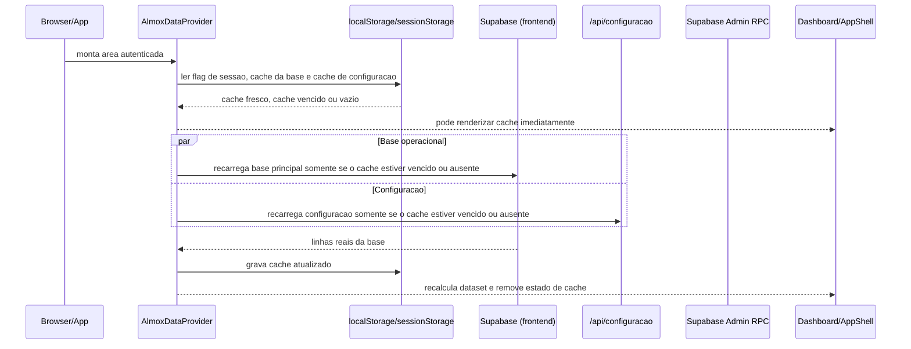

# Fluxo do Primeiro Carregamento

Documento tecnico para mapear o que acontece no primeiro carregamento da area logada, desde a liberacao da rota autenticada ate a exibicao dos dados na tela.

---

## 1. Escopo

Este fluxo cobre:

1. entrada na rota principal autenticada;
2. montagem do `AlmoxDataProvider`;
3. leitura de cache local;
4. requisicoes iniciais da base;
5. carregamento de configuracao;
6. hidratacao do dataset usado por Dashboard, Produtos, Emprestimos, Pedidos e Processos;
7. significado dos estados visuais de carregamento.

Fora de escopo:

- clique manual em "Atualizar estoque";
- importacao via GitHub Actions;
- telas de detalhe de nota fiscal.

---

## 2. Arquivos envolvidos

- Gate da area logada: [src/app/(app)/_layout.tsx](../src/app/(app)/_layout.tsx)
- Rota inicial da area logada: [src/app/(app)/index.tsx](../src/app/(app)/index.tsx)
- Shell da aplicacao: [src/features/almox/components/app-shell.tsx](../src/features/almox/components/app-shell.tsx)
- Provider principal de dados: [src/features/almox/almox-provider.tsx](../src/features/almox/almox-provider.tsx)
- Cache local/session: [src/features/almox/cache.ts](../src/features/almox/cache.ts)
- Montagem do dataset: [src/features/almox/data.ts](../src/features/almox/data.ts)
- Tipos principais: [src/features/almox/types.ts](../src/features/almox/types.ts)
- Cliente Supabase do frontend: [src/lib/supabase.ts](../src/lib/supabase.ts)
- API de configuracao: [src/app/api/configuracao+api.ts](../src/app/api/configuracao+api.ts)
- Persistencia de configuracao no backend: [src/server/almox-configuracao.ts](../src/server/almox-configuracao.ts)
- Primeira tela efetiva: [src/features/almox/screens/dashboard-screen.tsx](../src/features/almox/screens/dashboard-screen.tsx)

---

## 3. Visao geral

Assim que a rota autenticada e liberada, o sistema sobe o `AlmoxDataProvider`.

Esse provider tenta equilibrar tres coisas:

1. abrir a interface rapido, preferindo cache local se existir;
2. evitar recarga completa imediata quando o cache ainda esta dentro do TTL;
3. validar a base real no Supabase quando o cache estiver vencido ou ausente.

Ao mesmo tempo, ele busca a configuracao do sistema por uma API interna autenticada.

Os **processos de acompanhamento** nao entram mais nessa carga inicial global. Eles passaram a ser carregados sob demanda apenas na tela de Processos.

Resultado pratico:

- a tela pode abrir com dados locais antigos por alguns instantes;
- a configuracao pode chegar depois da base;
- o dataset pode ser recalculado algumas vezes no primeiro carregamento.

---

## 4. Ordem cronologica

---

## 5. O que monta primeiro

### 5.1 Gate autenticado

Em [src/app/(app)/_layout.tsx](../src/app/(app)/_layout.tsx):

- se o usuario estiver autenticado, o layout monta:
  - `AlmoxDataProvider`
  - `AppShell`

### 5.2 Rota inicial

Em [src/app/(app)/index.tsx](../src/app/(app)/index.tsx):

- a rota inicial reaproveita diretamente `dashboard-screen`.

Entao, na pratica, o primeiro carregamento de dados da area logada ja e o primeiro carregamento do dashboard.

### 5.3 Shell

Em [app-shell.tsx](../src/features/almox/components/app-shell.tsx):

- o shell usa `useAlmoxData()` para ler:
  - `dataset`
  - `categoryFilter`
  - `dashboardHospital`
  - dados do usuario autenticado

Ou seja: cabecalho, menu lateral e primeira tela principal dependem do provider.

---

## 6. Estado inicial do `AlmoxDataProvider`

Em [almox-provider.tsx](../src/features/almox/almox-provider.tsx), o provider sobe com:

- `rows = []`
- `blacklistItems = []`
- `cmmExceptionItems = []`
- `processItems = []`
- `loading = true`
- `refreshing = false`
- `usingCachedData = false`
- `lastRefreshAt = null`
- `error = null`
- `systemConfig = configuracaoSistemaPadrao`
- `systemConfigLoading = true`

Isso significa que, antes de qualquer resposta externa:

- a base ainda nao existe em memoria;
- o dataset inicial e derivado de `createEmptyDataset(systemConfigPadrao)`.

---

## 7. Leitura de cache logo no mount

No primeiro `useEffect` do provider:

1. `mountedRef.current = true`
2. le a flag de sessao em `sessionStorage`:
   - chave `almox:base:session:v1`
3. le o cache da base em `localStorage`:
   - chave `almox:base:v1`
4. le o cache da configuracao em `localStorage`:
   - chave `almox:config:v1`

As funcoes estao em [cache.ts](../src/features/almox/cache.ts):

- `readSessionFlag()`
- `readCachedValue()`
- `writeCachedValue()`
- `writeSessionFlag()`

### 7.1 O que tem dentro do cache

O cache principal salva:

- `rows`
- `blacklistItems`
- `cmmExceptionItems`

com envelope:

- `savedAt`
- `value`

O cache de configuracao salva:

- `config`
- `updatedAt`
- `savedAt`

O cache de processos e separado:

- chave `almox:processes:v1`
- TTL de `5 minutos`
- usado apenas quando a tela de Processos entra em uso

### 7.2 Quando o cache e usado

Se existirem ao mesmo tempo:

- flag de sessao = `true`
- cache = presente

o provider:

- marca `hasLoadedRef.current = true`
- joga o cache no estado React
- seta `lastRefreshAt = savedAt do cache`
- seta `loading = false`

Se o cache da base ainda estiver fresco:

- o provider usa o cache;
- **nao** dispara `refresh()` imediatamente;
- `usingCachedData` fica `false`, porque a copia ainda esta dentro da janela aceita pelo app.

Se o cache da base estiver vencido:

- o provider usa a copia local para abrir a tela;
- seta `usingCachedData = true`;
- dispara `refresh()` em background.

Isso faz a tela abrir imediatamente com os ultimos dados gravados no browser, mas evita recarga completa quando a base ainda esta dentro do TTL.

### 7.3 Observacao importante sobre frescor

`readCachedValue()` calcula `isFresh` e o provider agora usa esse campo.

Na pratica:

- o cache da base so dispara nova carga completa quando estiver vencido ou ausente;
- o TTL atual da base e de `5 minutos`.

Impacto:

- dentro da mesma sessao do navegador, aberturas repetidas dentro do TTL deixam de consumir uma nova leitura completa da base;
- isso reduz egress e diminui custo operacional no Free Plan.

### 7.4 Cache da configuracao

A configuracao do sistema tambem tem cache local agora.

Fluxo:

- se existir cache de configuracao fresco, o provider usa esse valor e nao chama `/api/configuracao` imediatamente;
- se o cache estiver vencido ou ausente, o provider chama `refreshSystemConfig()`.

TTL atual da configuracao:

- `30 minutos`

---

## 8. Requisicoes disparadas em paralelo

Depois da tentativa de hidratar do cache, o provider segue esta regra:

- `refresh()` so roda se a base estiver sem cache ou com cache vencido;
- `refreshSystemConfig()` so roda se a configuracao estiver sem cache ou com cache vencido.

Ou seja: a tela pode abrir totalmente do cache e nao consumir nova leitura imediata.

### 8.1 `refresh()` da base operacional

`refresh()` faz uma carga paralela resiliente de tres leituras:

1. `loadEstoqueAtualRows()`
2. `loadBlacklistItems()`
3. `loadCmmExceptionItems()`

Regra atual:

- `almox_estoque_atual` e a carga critica;
- `blacklist` e `excecoes de CMM` sao cargas auxiliares;
- se uma leitura auxiliar falhar, o app preserva a ultima versao valida dessa lista e continua com a base principal atualizada;
- nesse caso a UI mostra um banner de **atualizacao parcial da base**.

#### 8.1.1 `loadEstoqueAtualRows()`

Fonte:

- tabela/view `almox_estoque_atual`

Observacao importante:

- o contrato publico continua sendo `almox_estoque_atual`;
- desde a migration [20260423230000_materializar_estoque_atual.sql](../supabase/migrations/20260423230000_materializar_estoque_atual.sql), essa leitura passou a vir de uma tabela fisica de estado atual, e nao mais de uma view que recalcula o historico inteiro.

Comportamento:

- pagina com `PAGE_SIZE = 1000`
- seleciona apenas as colunas usadas pelo app, em vez de `select('*')`
- continua chamando `.range(start, end)` ate vir uma pagina menor que 1000

Ordenacao:

- `categoria_material`
- `codigo_unidade`
- `codigo_produto`

#### 8.1.2 `loadBlacklistItems()`

Fonte:

- `almox_exclusoes_hmsa`

Filtro:

- `ativo = true`

#### 8.1.3 `loadCmmExceptionItems()`

Fonte:

- `almox_excecoes_cmm_hmsa`

Filtro:

- `ativo = true`

### 8.2 `refreshSystemConfig()`

Esse fluxo nao le a configuracao direto do Supabase pelo client publico.

Ele chama:

- `GET /api/configuracao`

No backend:

- a API exige sessao valida do app;
- usa `lerConfiguracaoSistema()`;
- `lerConfiguracaoSistema()` chama RPC `listar_configuracao_sistema` com Supabase admin.

### 8.3 Carga sob demanda de processos

Processos agora seguem um fluxo proprio:

- a tela [processes-screen.tsx](../src/features/almox/screens/processes-screen.tsx) chama `refreshProcessItems()` ao montar;
- o provider primeiro tenta usar o cache `almox:processes:v1`;
- se esse cache estiver fresco, a tela abre sem nova consulta;
- se estiver vencido ou ausente, o provider consulta `almox_processos_acompanhamento`.

#### 8.3.1 `loadProcessItems()`

Fonte:

- `almox_processos_acompanhamento`

Filtro:

- `ativo = true`

Tratamento adicional:

- normaliza descricao;
- normaliza parcelas entregues;
- garante `total_parcelas` entre `1` e `6`.

---

## 9. Como o dataset e montado

O estado bruto do provider nao e o que as telas consomem direto.

As telas leem `dataset`, calculado por `useMemo`.

### 9.1 Passos da montagem

1. constroi `blacklistSet`
2. constroi `cmmExceptionSet`
3. remove da visao itens do HMSA que estao na blacklist manual
4. aplica `categoryFilter`:
   - `todos`
   - `material_hospitalar`
   - `material_farmacologico`
5. se sobrou linha:
   - chama `hydrateDataset(filteredRows, systemConfig, { cmmExceptionCodes })`
6. se nao sobrou linha:
   - chama `createEmptyDataset(systemConfig)`

### 9.2 O que `hydrateDataset()` entrega

Em [data.ts](../src/features/almox/data.ts):

- `productsByHospital`
- `dashboardByHospital`
- `intelligenceDetails`
- `loansNeeded`
- `canLend`
- `orderItems`
- `emailPreviewItems`
- `lastSync`

### 9.3 De onde vem `lastSync`

`dataset.lastSync` e calculado a partir do maior `importado_em` das `rows`.

Isto e:

- representa a ultima importacao persistida na base que efetivamente gerou aquelas linhas;
- nao representa o horario em que o navegador leu os dados.

---

## 10. O que cada timestamp significa

Hoje existem pelo menos dois tempos diferentes no primeiro carregamento:

### `dataset.lastSync`

Origem:

- `importado_em` das linhas de `almox_estoque_atual`

Significado:

- quando a base persistida foi importada pela ultima vez com os dados que o usuario esta vendo.

### `lastRefreshAt`

Origem:

- `new Date().toISOString()` quando `refresh()` termina no client;
- ou `savedAt` do cache local, quando a tela abre do navegador.

Significado:

- quando o app leu ou reaproveitou os dados localmente;
- nao quer dizer que houve nova importacao no banco.

Essa diferenca explica porque o usuario pode ver algo como:

- base atualizada em um horario;
- leitura do app em outro horario mais recente.

---

## 11. Estados visuais no primeiro carregamento

No dashboard, [dashboard-screen.tsx](../src/features/almox/screens/dashboard-screen.tsx) usa esses sinais:

### `loading`

Mostra:

- botao em estado de carregamento;
- textos como `carregando base` ou `carregando leitura`.

### `usingCachedData`

Mostra banner:

- "A tela abriu com a ultima base salva. O sistema esta conferindo se existe atualizacao mais recente..."

### `error`

Mostra banner:

- falha ao atualizar a base;
- os ultimos dados carregados continuam visiveis.

Esse comportamento e deliberado:

- se havia dado anterior em memoria ou cache, a tela nao zera quando a atualizacao falha.

### `systemConfigLoading`

Nao trava o dashboard inteiro.

Na pratica:

- o dashboard pode abrir com configuracao padrao;
- alguns calculos e faixas podem ser recalculados quando a configuracao real chega.

---

## 12. Sequencia real em dois cenarios

### 12.1 Cenario A: sem cache local

1. rota autenticada libera o provider;
2. provider sobe vazio e `loading = true`;
3. dispara `refresh()` e `refreshSystemConfig()` em paralelo;
4. quando a base volta, popula `rows`, `blacklist` e `excecoes`;
5. grava cache local;
6. quando a configuracao volta, recalcula o dataset com os parametros reais;
7. dashboard estabiliza.

### 12.2 Cenario B: com cache local

1. rota autenticada libera o provider;
2. provider encontra flag de sessao + cache;
3. se o cache estiver fresco:
   - tela abre imediatamente;
   - nao dispara nova leitura completa da base;
   - so consulta a rede se o cache de configuracao estiver vencido.
4. se o cache estiver vencido:
   - tela abre imediatamente com a copia local;
   - `usingCachedData = true`;
   - dispara `refresh()` em background.
5. se a base real voltar com mudanca:
   - substitui tudo;
   - `usingCachedData = false`;
   - atualiza `lastRefreshAt`;
   - regrava cache.
6. se a atualizacao falhar:
   - a tela continua com os dados anteriores;
   - `error` aparece em banner.

---

## 13. O que depende de cookie e o que nao depende

### Depende de cookie do app

- `GET /api/configuracao`
- `PUT /api/configuracao`
- `/api/siscore/sync`

### Nao depende de cookie do app

- leitura direta do Supabase no frontend para:
  - `almox_estoque_atual`
  - `almox_exclusoes_hmsa`
  - `almox_excecoes_cmm_hmsa`
  - `almox_processos_acompanhamento`

Isso acontece porque o client em [supabase.ts](../src/lib/supabase.ts) usa chave publica e nao persiste sessao do Supabase.

Consequencia:

- a base operacional inicial vem direto do Supabase pelo frontend;
- a configuracao do sistema vem por API interna autenticada do app.

---

## 14. Pontos que hoje merecem revisao

### 14.1 Base e configuracao chegam por caminhos separados

Base:

- Supabase direto no frontend.

Configuracao:

- API autenticada do app.

Efeito:

- a UI pode calcular a primeira versao com `configuracaoSistemaPadrao`;
- segundos depois recalcular tudo com a configuracao real.

### 14.2 Atualizacao parcial ainda pode manter listas auxiliares antigas

Se `blacklist` ou `excecoes de CMM` falharem:

- a base principal continua sendo atualizada;
- o app mantem a ultima versao valida dessas listas auxiliares;
- a UI avisa que houve **atualizacao parcial da base**.

Efeito:

- a tela segue operacional, o que e melhor para continuidade;
- mas algumas regras auxiliares podem ficar momentaneamente atrasadas ate a proxima leitura bem-sucedida.

### 14.3 A leitura inicial do estoque pode exigir varias paginas

`almox_estoque_atual` usa pagina de `1000`.

Se a view crescer:

- o tempo de primeira carga sobe em cascata porque sao varias chamadas sequenciais.

Observacao:

- a materializacao do estoque atual removeu o gargalo principal da consulta;
- ainda assim, crescimento de volume continua importando porque a paginacao completa da base permanece sequencial no frontend.

### 14.4 O app diferencia pouco "sem dados" de "falha ao ler"

Hoje a estrategia favorece manter a ultima visao disponivel, o que e bom para continuidade.

Mas isso torna importante explicar melhor ao usuario:

- se ele esta vendo base nova;
- cache local;
- ou apenas o ultimo dado reaproveitado apos falha.

---

## 15. Resumo executivo

Hoje o primeiro carregamento tenta:

1. abrir rapido com cache local;
2. evitar recarga total dentro do TTL;
3. validar base real e configuracao real apenas quando os caches estiverem vencidos.

Os principais artefatos desse fluxo sao:

- `rows` da `almox_estoque_atual`
- listas auxiliares de exclusao/excecao/processos
- `systemConfig`
- `dataset` derivado
- `lastSync` da base
- `lastRefreshAt` da leitura do app

O fluxo atual privilegia continuidade visual, reaproveitamento de cache e reducao de egress. O custo disso e que, quando o cache estiver vencido, o primeiro estado visto pelo usuario ainda pode nao ser o estado final estabilizado alguns instantes depois.
